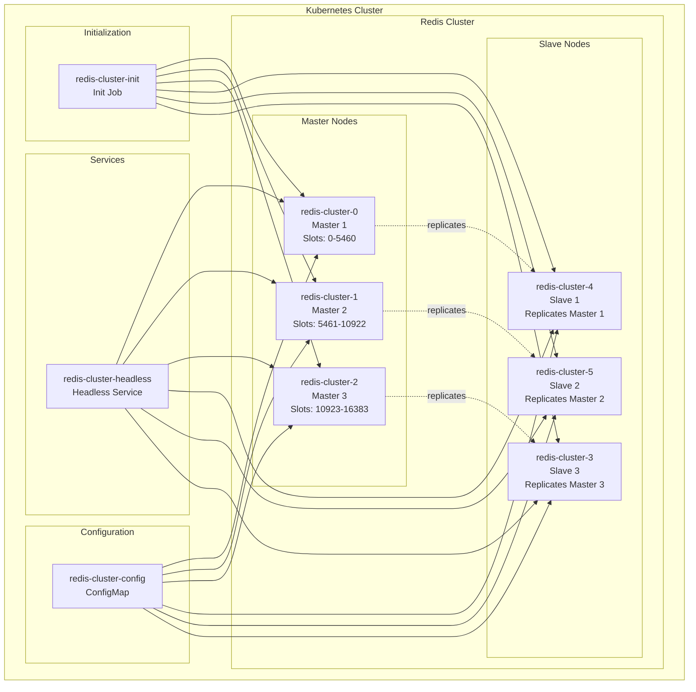

# Redis Cluster on Kubernetes

Kubernetes 환경에서 Redis 클러스터를 구성하고 관리하는 프로젝트입니다.

## 🏗️ 아키텍처



## 📁 프로젝트 구조

```
k8s/redis/
├── configmap.yaml      # Redis 클러스터 설정
├── service.yaml        # Headless 서비스
├── statefulset.yaml    # Redis StatefulSet
└── redis-cluster-init.yaml  # 클러스터 초기화 Job
```

## 🔧 구성 요소

### 1. ConfigMap (`configmap.yaml`)

Redis 클러스터 설정을 정의합니다.

```yaml
apiVersion: v1
kind: ConfigMap
metadata:
  name: redis-cluster-config
data:
  redis.conf: |
    cluster-enabled yes
    cluster-config-file nodes.conf
    cluster-node-timeout 5000
    appendonly yes
    protected-mode no
    bind 0.0.0.0
    port 6379
```

**주요 설정:**

- `cluster-enabled yes`: 클러스터 모드 활성화
- `cluster-config-file nodes.conf`: 클러스터 노드 정보 파일
- `cluster-node-timeout 5000`: 노드 타임아웃 (5초)
- `appendonly yes`: AOF 지속성 활성화
- `protected-mode no`: 보호 모드 비활성화 (외부 접근 허용)

### 2. Service (`service.yaml`)

Redis 클러스터를 위한 Headless 서비스를 정의합니다.

```yaml
apiVersion: v1
kind: Service
metadata:
  name: redis-cluster-headless
spec:
  clusterIP: None # Headless 서비스
  ports:
    - port: 6379 # Redis 포트
    - port: 16379 # 클러스터 버스 포트
  selector:
    app: redis-cluster
```

**특징:**

- `clusterIP: None`: Headless 서비스로 DNS 레코드 생성
- 각 Pod에 대해 `pod-name.service-name.namespace.svc.cluster.local` 형태의 DNS 레코드 생성

### 3. StatefulSet (`statefulset.yaml`)

Redis 클러스터 Pod들을 관리합니다.

```yaml
apiVersion: apps/v1
kind: StatefulSet
metadata:
  name: redis-cluster
spec:
  serviceName: redis-cluster-headless
  replicas: 6 # 3개 마스터 + 3개 슬레이브
  selector:
    matchLabels:
      app: redis-cluster
  template:
    metadata:
      labels:
        app: redis-cluster
    spec:
      containers:
        - name: redis
          image: redis:6.2
          ports:
            - containerPort: 6379
            - containerPort: 16379
          command:
            - redis-server
            - /etc/redis/redis.conf
          volumeMounts:
            - name: redis-config
              mountPath: /etc/redis
            - name: redis-data
              mountPath: /data
      volumes:
        - name: redis-config
          configMap:
            name: redis-cluster-config
  volumeClaimTemplates:
    - metadata:
        name: redis-data
      spec:
        accessModes: ['ReadWriteOnce']
        resources:
          requests:
            storage: 1Gi
```

**특징:**

- **6개 Pod**: 3개 마스터 + 3개 슬레이브
- **영구 스토리지**: 각 Pod마다 1Gi PVC 할당
- **고정 네이밍**: `redis-cluster-0` ~ `redis-cluster-5`
- **설정 마운트**: ConfigMap을 `/etc/redis`에 마운트

### 4. Init Job (`redis-cluster-init.yaml`)

Redis 클러스터를 초기화하는 Job입니다.

```yaml
apiVersion: batch/v1
kind: Job
metadata:
  name: redis-cluster-init
spec:
  template:
    spec:
      serviceAccountName: default
      volumes:
        - name: shared-data
          emptyDir: {}
      containers:
        - name: kubectl
          image: bitnami/kubectl:latest
          volumeMounts:
            - name: shared-data
              mountPath: /tmp
          command:
            - sh
            - -c
            - |
              sleep 30
              echo "Getting Redis cluster pod IPs..."
              POD0_IP=$(kubectl get pod redis-cluster-0 -o jsonpath='{.status.podIP}')
              POD1_IP=$(kubectl get pod redis-cluster-1 -o jsonpath='{.status.podIP}')
              POD2_IP=$(kubectl get pod redis-cluster-2 -o jsonpath='{.status.podIP}')
              POD3_IP=$(kubectl get pod redis-cluster-3 -o jsonpath='{.status.podIP}')
              POD4_IP=$(kubectl get pod redis-cluster-4 -o jsonpath='{.status.podIP}')
              POD5_IP=$(kubectl get pod redis-cluster-5 -o jsonpath='{.status.podIP}')

              echo "Creating Redis cluster with IPs: $POD0_IP, $POD1_IP, $POD2_IP, $POD3_IP, $POD4_IP, $POD5_IP"
              echo "$POD0_IP:6379 $POD1_IP:6379 $POD2_IP:6379 $POD3_IP:6379 $POD4_IP:6379 $POD5_IP:6379" > /tmp/redis-nodes.txt
              echo "Redis cluster nodes saved to /tmp/redis-nodes.txt"
        - name: redis-init
          image: redis:6.2
          volumeMounts:
            - name: shared-data
              mountPath: /tmp
          command:
            - sh
            - -c
            - |
              sleep 35
              echo "Reading Redis cluster nodes from file..."
              NODES=$(cat /tmp/redis-nodes.txt)
              echo "Creating Redis cluster with nodes: $NODES"
              redis-cli --cluster create $NODES --cluster-replicas 1 --cluster-yes
              echo "Redis cluster created successfully!"
      restartPolicy: OnFailure
```

**특징:**

- **다중 컨테이너**: kubectl과 redis-cli를 각각 실행
- **IP 주소 동적 획득**: DNS 대신 Pod IP를 직접 사용
- **볼륨 공유**: 두 컨테이너 간에 IP 정보 공유
- **OrbStack 호환**: 네트워킹 문제 해결

## 🚀 배포 방법

### 1. Redis 클러스터 배포

```bash
# 모든 리소스 배포
kubectl apply -f k8s/redis/

# 또는 개별 배포
kubectl apply -f k8s/redis/configmap.yaml
kubectl apply -f k8s/redis/service.yaml
kubectl apply -f k8s/redis/statefulset.yaml
```

### 2. Pod 상태 확인

```bash
# Pod 상태 확인
kubectl get pods | grep redis-cluster

# StatefulSet 상태 확인
kubectl get statefulset redis-cluster

# 서비스 확인
kubectl get svc | grep redis-cluster
```

### 3. 클러스터 초기화

```bash
# 초기화 Job 실행
kubectl apply -f k8s/redis/redis-cluster-init.yaml

# Job 완료 대기
kubectl wait --for=condition=complete job/redis-cluster-init --timeout=120s
```

### 4. 클러스터 상태 확인

```bash
# 클러스터 정보 확인
kubectl exec redis-cluster-0 -- redis-cli cluster info

# 클러스터 노드 확인
kubectl exec redis-cluster-0 -- redis-cli cluster nodes

# 클러스터 상태 체크
kubectl exec redis-cluster-0 -- redis-cli --cluster check redis-cluster-0.redis-cluster-headless:6379
```

## 🔍 모니터링 및 관리

### 클러스터 상태 확인

```bash
# 클러스터 정보
kubectl exec redis-cluster-0 -- redis-cli cluster info

# 노드 목록
kubectl exec redis-cluster-0 -- redis-cli cluster nodes

# 슬롯 정보
kubectl exec redis-cluster-0 -- redis-cli cluster slots
```

### 데이터 테스트

```bash
# Redis 클라이언트 접속
kubectl exec -it redis-cluster-0 -- redis-cli

# 키 설정 및 조회
kubectl exec redis-cluster-0 -- redis-cli set test-key "Hello Redis Cluster"
kubectl exec redis-cluster-0 -- redis-cli get test-key
```

### 로그 확인

```bash
# Pod 로그 확인
kubectl logs redis-cluster-0
kubectl logs redis-cluster-1

# 초기화 Job 로그 확인
kubectl logs job/redis-cluster-init
```

## 🧹 정리

### 리소스 삭제

```bash
# 모든 Redis 리소스 삭제
kubectl delete -f k8s/redis/

# 개별 삭제
kubectl delete statefulset redis-cluster
kubectl delete service redis-cluster-headless
kubectl delete configmap redis-cluster-config
kubectl delete job redis-cluster-init
```

## ⚠️ 주의사항

### OrbStack 환경

- DNS 해결 문제가 발생할 수 있음
- IP 주소를 직접 사용하는 방식으로 해결
- 네트워킹 설정 확인 필요

### 리소스 요구사항

- 각 Pod당 최소 1Gi 스토리지 필요
- 메모리: Pod당 최소 512Mi 권장
- CPU: Pod당 최소 250m 권장

### 고가용성

- 3개 마스터 + 3개 슬레이브 구성
- 마스터 장애 시 슬레이브가 자동 승격
- 최소 3개 노드 필요 (쿼럼)

## 📊 성능 최적화

### 설정 튜닝

```yaml
# redis.conf 추가 설정
maxmemory 512mb
maxmemory-policy allkeys-lru
save 900 1
save 300 10
save 60 10000
```

### 리소스 제한

```yaml
resources:
  requests:
    memory: '512Mi'
    cpu: '250m'
  limits:
    memory: '1Gi'
    cpu: '500m'
```

## 🔗 관련 링크

- [Redis Cluster Documentation](https://redis.io/topics/cluster-tutorial)
- [Kubernetes StatefulSets](https://kubernetes.io/docs/concepts/workloads/controllers/statefulset/)
- [OrbStack Documentation](https://docs.orbstack.dev/)
